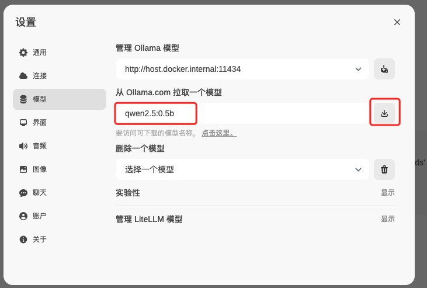

## 魔方AI实践

### 实践背景

> 改善租房用户App客服体验，结合LLM大模型进行客服解答和找房推荐

### 项目依赖软件、工具

> 使用请自行查阅

* [Docker](https://www.docker.com/) Docker容器
* [Ollama](https://ollama.com/) LLM快速搭建工具
* [MilvusDb](https://milvus.io/) 高性能矢量数据库  [桌面工具下载](https://github.com/zilliztech/attu)
* [Qwen2.5](https://github.com/QwenLM/Qwen2.5) QWen2.5 阿里千问大模型
* [Python](https://www.python.org/) Python 开发语言
* [sentence-transformers](https://sbert.net/) transformers实现
* [all-MiniLM-L6-v2](https://huggingface.co/sentence-transformers/all-MiniLM-L6-v2) 句子转换器模型
* [open-webui](https://github.com/open-webui/open-webui) 管理和操作各种web 应用程序和服务


### 启动

> 本项目使用Docker构建环境，启动命令，请点击此链接[Docker](https://www.docker.com/)下载安装

##### 1.下载并运行

```
# 下载仓库
git clone https://github.com/rockywu/mf-ai.git
# 进入目录
cd mf-ai
# 运行启动(如果不支持MakeFile可以使用2启动
启动方式1:  make start 
启动方式2:  docker compose -f ./docker/docker-compose.yml up -d --build
# 手动下载所需模型
下载方式1：make pullQwen2.5
下载方式2：docker exec -it $$(docker container ls |grep mf_ai_ollama | awk '{print $$1}') ollama run qwen2.5:0.5b
下载方式3：参考网页下载模型
```

##### 2.网页端下在大模型

> [OpenWebUI](http://localhost:11081) 下载自己所需的模型。`CPU环境,建议qwen2.5:0.5b模型`，[GPU环境文档](https://hub.docker.com/r/ollama/ollama)



### 访问服务

* **Api** [http://localhost:11080](http://localhost:11080) 魔方推荐API服务
* **OpenWebUi** [http://localhost:11081](http://localhost:11081)  管理和操作各种web 应用程序和服务
* **OllamaApi** [http://localhost:11082](http://localhost:11082)  Ollama api地址
* **MilvusDb** [http://localhost:11083](http://localhost:11083)  账号：root  密码：52MfAi
